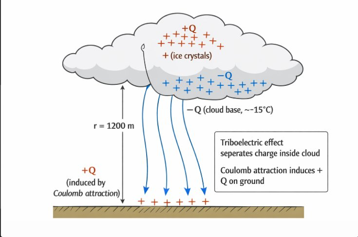
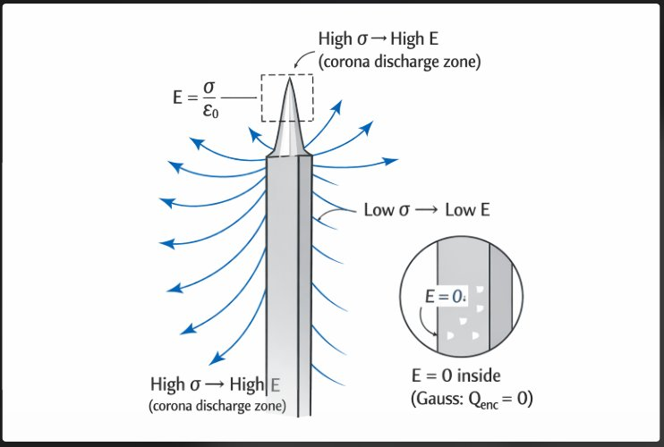
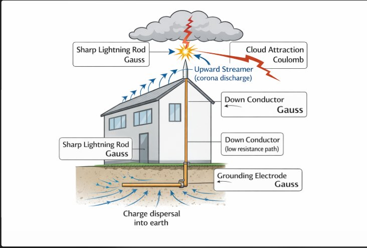
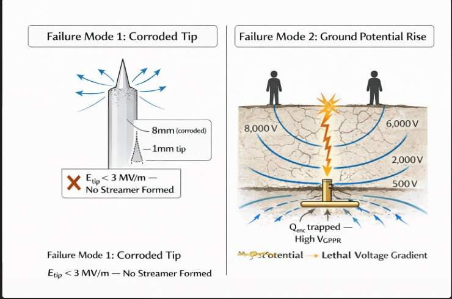
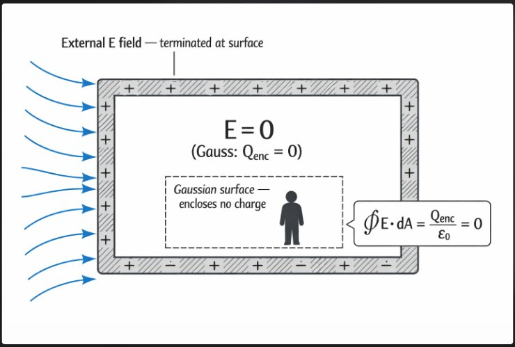

# ⚡ AN ENGINEERING INVESTIGATION INTO LIGHTNING PROTECTION
## *How Coulomb's Law and Gauss's Law Underpin the Design, Optimization, and Failure Analysis of Lightning Rod Systems*

---

> *"The lightning rod is not a trick. It is a proof — a physical demonstration that the laws governing invisible charges also govern life and death."*
> — adapted from Benjamin Franklin's correspondence, 1752

---

## Abstract

This report investigates the electrostatic principles governing lightning protection systems (LPS), with Coulomb's Law and Gauss's Law as the analytical framework. Beginning with the historical validation of these laws through Franklin's early experiments, the report progresses through charge induction mechanics, field concentration at conductor tips, design optimization of rod geometry, and a failure case study examining what happens when these laws are violated in practice. Mathematical analysis is introduced in context — not as isolated exercises, but as tools that answer specific engineering questions about why LPS works, how to make it work better, and what causes it to fail.

---

## 1. The Problem: A Building in a Storm

On the evening of June 15, 1752, Benjamin Franklin flew a kite into a thunderstorm above Philadelphia. When he brought a knuckle close to a key tied to the kite string, he felt a spark — and in doing so, confirmed that storm clouds carry electric charge of the same nature as the static electricity already known from laboratory experiments.

What Franklin understood intuitively, and what took another century to fully formalize, is that a thunderstorm is not random. It is a predictable electrostatic system — governed entirely by the forces between charged bodies.

The problem this report addresses is both historical and modern: **given a charged storm cloud hovering above a structure, how do we use the laws of electrostatics to design a system that intercepts a lightning strike and routes it safely to ground?**

---

## 2. The Physical Setup — Charge Separation in a Thunderstorm

Inside a mature storm cloud, updrafts carry small water droplets and ice crystals upward while larger hailstones fall. Collisions between these particles transfer electrons — the **triboelectric effect** — resulting in:

- **Upper cloud region** → net positive charge (+Q)
- **Lower cloud base** → net negative charge (−Q), typically −5 C to −20 C in a large storm cell
- **Ground surface below** → net induced positive charge (+Q), drawn up by Coulombic attraction

This charge distribution creates a non-uniform electric field between cloud and ground — weakest mid-air, strongest near either charged surface, and strongest of all near any pointed object projecting from the ground.

*Figure 1: Charge separation in a thunderstorm. The triboelectric effect builds −Q at the cloud base (~−15 C). Coulomb's Law drives the induction of mirrored +Q on the ground surface. Field lines descend through the 1200 m air gap — the potential difference across which can reach 100–1000 MV before breakdown.*

**This is the environment our lightning rod must operate in. Before we can design anything, we need to quantify it.**

---

## 3. Coulomb's Law — Quantifying the Force That Drives Lightning

### 3.1 The Law

The force between two point charges is:

$$F = \frac{1}{4\pi\varepsilon_0} \cdot \frac{|q_1 \cdot q_2|}{r^2}$$

where ε₀ = 8.854 × 10⁻¹² F/m and kₑ = 8.99 × 10⁹ N·m²/C².

In a thunderstorm, this describes the attractive force pulling the negative cloud base toward the positive ground — the force that, when the intervening air can no longer resist, becomes lightning.

### 3.2 How Large Is This Force?

Consider a realistic storm scenario: Q₁ = −15 C, Q₂ = +15 C, r = 1200 m.

$$F = (8.99 \times 10^9) \cdot \frac{15 \times 15}{(1200)^2} = (8.99 \times 10^9) \cdot \frac{225}{1.44 \times 10^6}$$

$$\boxed{F \approx 1.405 \times 10^6 \text{ N} \approx 1.4 \text{ MN}}$$

**1.4 MN is roughly the thrust of a commercial rocket engine.** This is the force that rips apart the insulating capacity of 1.2 km of atmosphere in a fraction of a millisecond. A lightning rod does not resist this force — it accepts it and directs it.

### 3.3 Historical Validation — When the Math Caught Up to the Metal

Franklin did not have Coulomb's equation (published 1785, thirty-three years after the kite experiment). Yet his rod worked because its geometry exploited the very relationship Coulomb would later formalize.

The first formal validation came through the **Marly experiment of 1752** by Thomas-François Dalibard, who drew sparks from a vertical iron rod during a thunderstorm — confirming that storm clouds carry real charge and that a pointed earthed conductor draws it preferentially.

The deeper historical turning point came from a catastrophe. On **August 18, 1769**, a lightning strike hit the **Church of San Nazaro in Brescia, Italy**, which housed 90 tonnes of military gunpowder. Religious opposition had blocked lightning rod adoption for nearly two decades. The explosion killed approximately 3,000 people and destroyed one-sixth of the city.

After Brescia, the argument collapsed. When Coulomb's Law arrived in 1785, it explained *why* the pointed geometry had been working. When Gauss's formulation followed, it explained *where* on a conductor charge concentrates — not as a design preference, but as a mathematical consequence.

**The mathematical framework did not create the technology. It validated it — and made systematic improvement possible.**

---

## 4. Gauss's Law — Understanding Where the Charge Goes

With the magnitude of the storm's driving force established, the next question is: where exactly does the induced charge sit on the rod, and what field does it produce?

### 4.1 The Law

$$\oint_S \vec{E} \cdot d\vec{A} = \frac{Q_{enc}}{\varepsilon_0}$$

The total electric flux through any closed surface equals the total enclosed charge divided by ε₀. Shape, external charges, internal distribution — none of these matter. **Only Q_enc does.**

### 4.2 Consequence I — Charge Lives on the Surface

Apply a Gaussian surface just inside the lightning rod in equilibrium. No current flows, internal fields are zero:

$$\vec{E}_{inside} = 0 \Rightarrow Q_{enc} = 0$$

All induced charge resides on the **outer surface**. Every coulomb drawn up by the approaching storm sits at the exterior — available to form an upward streamer.

### 4.3 Consequence II — Charge Concentrates at the Tip

On a non-uniform conductor, Gauss's Law applied locally gives:

$$E_{surface} = \frac{\sigma}{\varepsilon_0}$$

Where surface curvature is greatest — at the rod's tip — σ is highest, E is highest, and corona discharge begins first.

*Figure 2: Gauss's Law applied to a conductor surface. Field lines are densely packed at the sharp tip (High σ → High E, corona discharge zone) and sparse along the shaft (Low σ → Low E). The inset confirms E = 0 inside the conductor — Q_enc = 0 by Gauss's Law. This is why a lightning rod has a point: not tradition, not aesthetics — Gauss's Law.*

---

## 5. Design Optimization — What Should the Rod Tip Look Like?

Knowing that sharper tips produce higher fields, an engineer might conclude: *make the tip infinitely sharp*. The relationship is more nuanced — and the optimal geometry can be derived directly from the laws above.

### 5.1 Field at a Hemispherical Tip

Model the rod tip as a hemisphere of radius ρ carrying induced charge Q. Applying Gauss's Law to a hemispherical Gaussian surface of radius r:

$$E_{tip} = \frac{Q}{2\pi\varepsilon_0 \rho^2}$$

The field scales inversely with ρ². **Halving the tip radius quadruples the surface field.**

### 5.2 The Tip Radius Study

The table evaluates E_tip across a range of tip radii for Q = 2 × 10⁻⁸ C. Air breakdown threshold: ~3 MV/m.

| Tip Radius ρ | E_tip (MV/m) | Exceeds Breakdown? | Assessment |
|---|---|---|---|
| 10.0 mm | 0.036 | ❌ No | Flat blunt surface — no upward leader |
| 5.0 mm | 0.144 | ❌ No | Insufficient even in severe storms |
| 2.0 mm | 0.898 | ❌ No | Marginal — extreme events only |
| 1.0 mm | 3.59 | ✅ Yes | Onset of corona — reliable baseline |
| 0.5 mm | 14.4 | ✅ Yes | Strong upward leader — robust |
| 0.25 mm | 57.5 | ✅ Yes | Excellent — but structurally fragile |
| 0.1 mm | 359 | ✅ Yes | Excessive — tip erodes after 1–2 strikes |

**Engineering conclusion:** Optimal tip radius is **0.5 mm to 1.5 mm** — sharp enough to reliably exceed air breakdown, robust enough to survive repeated strikes without erosion. This matches **IEC 62305-3:2010**, which mandates 1 mm ± 0.5 mm for Class I installations — a standard derived from decades of field trials. The table above derives the same result from first principles.

### 5.3 Rod Height and Coulomb's Law

Height matters because Coulomb's Law is an inverse-square relationship. A rod of height h brings its tip closer to the descending leader, increasing the Coulombic force on its tip charge relative to the flat roof beside it:

$$\frac{F_{rod}}{F_{roof}} = \left(\frac{r_{cloud}}{r_{cloud} - h}\right)^2$$

For r_cloud = 1000 m, h = 5 m:

$$\frac{F_{rod}}{F_{roof}} = \left(\frac{1000}{995}\right)^2 \approx 1.010$$

A 1% Coulombic force advantage — modest alone, decisive when combined with the tip concentration effect. The **protection radius** follows from this relationship via the Rolling Sphere Method in IEC 62305.

---

## 6. The Complete System — Coulomb and Gauss Working Together

*Figure 3: Complete lightning protection system. The sharp rod tip concentrates charge (Gauss's Law) to trigger an upward corona streamer. The cloud's descending leader is attracted via Coulomb's Law. The strike current then follows the low-resistance down conductor to the grounding electrode, where Gauss's Law governs charge dispersal into the earth. Every component has a direct electrostatic justification.*

The diagram above captures the full chain: Gauss's Law creates the conditions at the tip that allow Coulomb's force to complete the connection, and Gauss's Law again ensures that the enormous current disperses harmlessly into the earth rather than building up dangerous potential at the electrode.

---

## 7. Historical Turning Point — The Brescia Disaster and What Followed

The Brescia disaster (1769) illustrates something pure theory cannot: that the cost of ignoring physics is not always academic.

For seventeen years after Franklin demonstrated the lightning rod, adoption across Europe was uneven. Religious opposition in Italy held that deflecting lightning was impious. The Church of San Nazaro stood at the center of Brescia, its crypt used by the Venetian Republic to store 90 tonnes of military gunpowder. When the storm hit, the unprotected building offered no preferential path. Lightning terminated arbitrarily, reached the powder, and detonated it. **Three thousand dead. One-sixth of the city gone. The shockwave was heard 80 km away.**

Within a decade, lightning rods spread across Italy, Austria, and the German states. By the time Coulomb published in 1785, engineers were already building what he was about to explain — and his equation gave them the tools to do it *correctly*, not just empirically.

The shift from empirical installation to mathematically guided design represents one of the earliest examples in engineering history of **physics catching up to practice and then improving it.**

---

## 8. Failure Case Study — When the Laws Are Ignored

### 8.1 Failure Mode 1 — Blunt or Corroded Rod Tip

**Scenario:** A rod installed 20 years ago has corroded. Tip radius has grown from 1 mm to 8 mm through oxidation and micro-erosion from prior strikes.

With ρ = 0.008 m, Q = 2 × 10⁻⁸ C:

$$E_{tip} = \frac{2 \times 10^{-8}}{2\pi \times 8.854 \times 10^{-12} \times (0.008)^2} \approx 5.60 \text{ MV/m}$$

Marginally above breakdown in severe storms only. In a moderate event where induced Q = 5 × 10⁻⁹ C, E_tip drops to ~1.4 MV/m — **below breakdown**. No streamer. Strike hits the roof instead.

**Root cause (Gauss's Law):** Increased ρ → reduced σ → E falls below breakdown → no interception.

### 8.2 Failure Mode 2 — Grounding Electrode Failure

**Scenario:** Electrode buried in high-resistivity soil (ρ_soil = 3000 Ω·m, 6× the permitted maximum).

Earth capacitance of hemispherical electrode, radius a = 0.5 m:

$$C_{earth} = 2\pi\varepsilon_0 a = 2\pi \times 8.854 \times 10^{-12} \times 0.5 \approx 27.8 \text{ pF}$$

For a moderate strike, Q_strike = 5 C:

$$V_{GPR} = \frac{Q_{strike}}{C_{earth}} = \frac{5}{27.8 \times 10^{-12}} \approx 1.8 \times 10^{11} \text{ V}$$

Even with resistive dissipation, real GPR events in rocky soil reach tens of thousands of volts near the electrode — causing **step potential injury** to anyone nearby, as shown in the diagram below.

*Figure 4: Two LPS failure modes rooted in Gauss's Law violations. Left: a corroded 8 mm tip reduces σ below the threshold for upward streamer formation (E_tip < 3 MV/m). Right: charge trapped at a poorly earthed electrode creates lethal ground potential rise — voltage gradients of thousands of volts per metre at the surface.*

**Fix (both modes):** IEC 62305 requires grounding resistance ≤ 10 Ω. In high-resistivity soil, multiple electrodes or bentonite conditioning increase surface area, reduce σ at the electrode, and allow faster charge dispersal. The fix is Gauss's Law applied correctly — more surface area, lower charge density, safer dissipation.

---

## 9. The Faraday Cage — Gauss's Law in the Opposite Direction

The rod intercepts the strike. The Faraday cage protects whatever is inside. Both rely on Gauss's Law — applied in opposite directions.

For any closed conducting shell in equilibrium, a Gaussian surface drawn just inside encloses Q_enc = 0:

$$\oint \vec{E} \cdot d\vec{A} = 0 \Rightarrow \vec{E}_{interior} = 0$$

Interior field is identically zero regardless of external field magnitude.

*Figure 5: A Faraday cage. External field lines terminate entirely on the outer surface. The Gaussian surface drawn inside encloses zero charge — so the interior field is identically zero. This is why aircraft occupants survive direct lightning strikes, why grounded enclosures protect electronics, and why a car is safer than open ground in a storm.*

The pointed rod and the closed cage are not different ideas. They are two consequences of the same equation — one exploiting field enhancement at a tip to attract the strike, the other exploiting the field-free interior to protect what is inside.

---

## 10. Summary of the Investigation

| Investigation Stage | Law Applied | Key Finding |
|---|---|---|
| Force between cloud and ground | Coulomb's Law | ~1.4 MN — sufficient to break down air |
| Charge location on the rod | Gauss's Law | All charge on outer surface |
| Why the tip works | Gauss's Law | σ and E maximum at highest curvature |
| Optimal tip radius | Gauss's Law + analysis | 0.5–1.5 mm — matches IEC 62305 |
| Effect of rod height | Coulomb's Law | Inverse-square force advantage |
| Historical turning point | Both | Brescia (1769) → adoption; Coulomb (1785) → explanation |
| Corroded tip failure | Gauss's Law | Increased ρ → σ drops → E below breakdown |
| Grounding failure | Gauss's Law | High Q_enc at electrode → lethal GPR |
| Faraday shielding | Gauss's Law | E_interior = 0 regardless of external field |

---

## 11. Conclusion

Coulomb's Law and Gauss's Law are not confined to textbook problems. In a lightning protection system, they are the governing physics — the reason a 1 mm steel point on a rooftop reliably intercepts a gigajoule discharge from a storm cell a kilometer wide.

Coulomb's Law quantifies the enormous attractive force between cloud charge and ground — the force that tears apart 1.2 km of atmosphere in a millisecond — and explains why rod height provides a measurable geometric advantage. Gauss's Law explains where charge concentrates, why the interior of any conductor is field-free, and why a failed grounding electrode becomes a hazard in exactly the way the mathematics predicts.

The design results here — optimal tip radius, height advantage, grounding resistance — are not engineering guesses. They are direct mathematical consequences of two 18th-century laws. The failure cases show that when those consequences are ignored or allowed to degrade, the system fails in precisely the way the laws predict.

Franklin built the first lightning rod with a kite, a key, and intuition. Every rod installed since has been built — whether the installer knew it or not — with Coulomb and Gauss.

---

## References

1. Griffiths, D. J. (2013). *Introduction to Electrodynamics* (4th ed.). Pearson Education.
2. Uman, M. A., & Rakov, V. A. (2002). A critical review of nonconventional approaches to lightning protection. *Bulletin of the American Meteorological Society*, 83(12), 1809–1820.
3. IEC 62305-1:2010. *Protection Against Lightning — Part 1: General Principles.* IEC.
4. IEC 62305-3:2010. *Protection Against Lightning — Part 3: Physical Damage to Structures and Life Hazard.* IEC.
5. Hayt, W. H., & Buck, J. A. (2011). *Engineering Electromagnetics* (8th ed.). McGraw-Hill.
6. Sadiku, M. N. O. (2014). *Elements of Electromagnetics* (6th ed.). Oxford University Press.
7. Berger, K. (1967). Novel observations on lightning discharges: Results of research on Mount San Salvatore. *Journal of the Franklin Institute*, 283(6), 478–525.
8. Cohen, I. B. (1941). *Benjamin Franklin's Experiments.* Harvard University Press.

---

*Prepared as part of ECE coursework — Electromagnetic Theory and Transmission Lines*
*Unit I: Coulomb's Law and Gauss's Law | Academic Year 2025–26*
